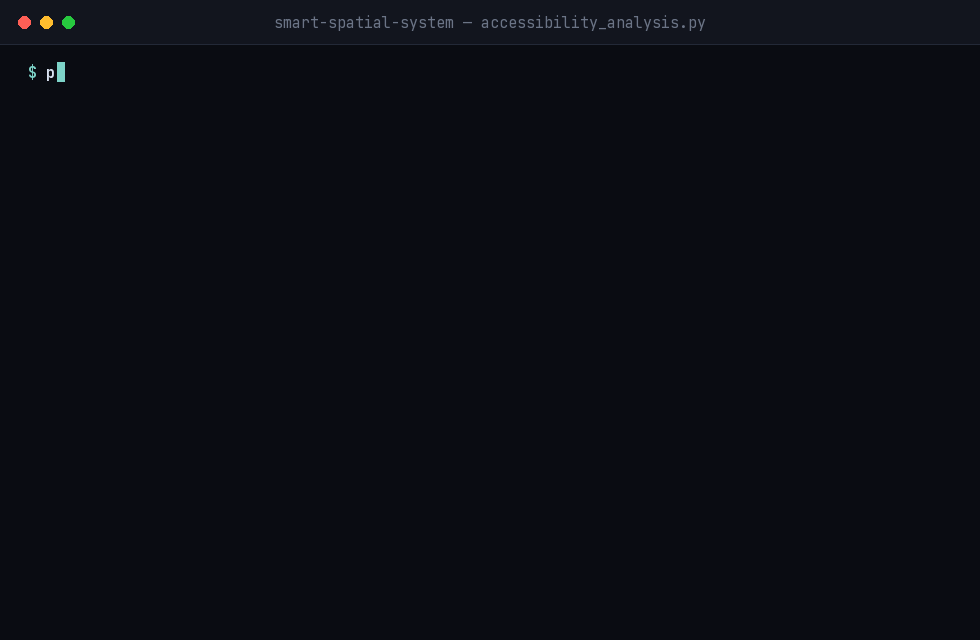

# Smart Spatial System

[](https://pypi.org/project/smart-spatial-system/)
[](https://github.com/arazshah/smart_spatial_system/actions/workflows/ci.yml)
[](LICENSE)
[](pyproject.toml)

**Ask a geospatial question in plain language and get map layers, tables, reports and files back.**

**[s3geo.com](https://s3geo.com)** — project site, plugin catalog and case-study index.

Smart Spatial System is a plugin-based GeoAI backend with a React workbench. A question such as *"rank these candidate properties by distance to metro stations, malls and main roads"* is turned into a structured `QuerySpec`, planned as a DAG of spatial operations, executed by plugins against uploaded files or PostGIS, and returned as map-ready outputs with a full execution trace.



Real, unedited terminal output from [`examples/accessibility_analysis.py`](examples/accessibility_analysis.py) — no server, no LLM, deterministic by construction. Run it yourself after installing below.

It is the application built on top of [geochat-platform](https://github.com/arazshah/geochat-platform): plugins are written with `geochat_sdk` and executed through `geochat_kernel`.

> **Status:** published and usable, still refactoring internally. Logic is moving out of `orchestrator/` into the layered `smart_spatial_system/` package (see [docs/ARCHITECTURE_TARGET.md](docs/ARCHITECTURE_TARGET.md)); the `orchestrator/*_service.py` modules are compatibility shims during that move. The public surface - the CLI, the HTTP API and the documented entry points below - is stable.

## Why this, not a general-purpose LLM agent with a GIS tool belt

The natural alternative is: give an LLM function-calling access to some GIS
functions and let it decide what to call. This project deliberately doesn't
stop there, for reasons that turned out to matter in practice, not just in
theory - see [`smart-spatial-vienna-accessibility`](https://github.com/arazshah/smart-spatial-vienna-accessibility)'s
case study and [`CHANGELOG.md`](CHANGELOG.md)'s `0.2.1`-`0.2.4` entries for
five real bugs this surfaced and fixed:

- **A deterministic path exists alongside the LLM path**, built from the same
  operation catalog (`OP_CATALOG`). The same analysis can be run by rule and
  by LLM, so "is the LLM's plan reliable" is a measurable question (Plan
  Agreement Rate, Rank Stability - see [docs/CASE_STUDIES.md](docs/CASE_STUDIES.md)), not
  a leap of faith.
- **Every LLM-generated plan is validated before execution**, not just before
  syntax errors: missing input roles, an unchained multi-factor scoring step,
  an asymmetric CRS reprojection, an untyped scoring factor - each is a
  distinct, previously-silent failure mode this system now catches and raises
  a specific error for, before spending a single second executing.
- **Every plugin carries a full execution trace** - which operations ran, in
  what order, with what parameters - so a wrong answer is debuggable, not a
  black box.

---

## How a query runs

```text
natural-language question
  → QuerySpec            LLM (OpenAI-compatible) or rule-based, with PostGIS semantic context
  → DeterministicPlanner + OP_CATALOG
  → DagPlan → DagExecutor
  → CapabilityRegistry   weighted router, learns from user feedback
  → geochat_sdk plugins  vector, raster, PostGIS, reporting, export
  → outputs              map layers · tables · documents (PDF/HTML) · files · trace
```

Design decisions are recorded as ADRs in [`docs/`](docs): single kernel pipeline, artifact-based responses, a multilingual semantic layer (English and Persian questions, language-neutral concepts inside), and a service-oriented modular backend.

## What is in the box

- **36 plugins registered by default**: buffer, spatial join, intersection, predicates, dissolve, nearest neighbour, distance, area and perimeter, centroids, CRS transform, geometry validation, attribute statistics, zonal statistics, band math, NDVI and spectral indices, slope/aspect, raster clip/reclassify/threshold/statistics, raster-to-vector, WMS/WFS fetcher, PostGIS connector, feature scoring and enrichment, vector loader, report builder, PDF renderer and data export. Raster uploads load through `local_raster_loader`, and `geocoding_resolver` ships but is not registered by default.
- **Data sources:** raster and vector uploads, CSV tables, WMS, WFS, PostGIS and remote URLs, grouped into projects.
- **Workflows:** multi-amenity accessibility scoring (rule-based, reproducible), real-estate site ranking with a generated PDF report, and NDVI analysis.
- **Learning router:** capability weights adjust from user feedback, with reviewable weight proposals.
- **Workbench:** React + Leaflet UI for queries, step-by-step progress, map layers, inspection, plugin settings and outputs.

## Repository layout

```text
api/                     FastAPI app and routers
orchestrator/            query parsing, planning (QuerySpec, OP_CATALOG, DAG), routing, services
smart_spatial_system/    new layered package (application services; other layers being filled in)
plugins/                 geochat_sdk capability plugins
config/plugins/          per-plugin YAML config (*.example.yaml are the templates)
templates/reports/       report templates (real-estate report)
scripts/sql/             PostGIS views for the Tehran OSM demo
examples/                runnable examples and their sample data
frontend/                React + Vite workbench
tests/                   pytest suite (~150 modules)
docs/                    architecture, ADRs, API contracts, phase reports
```

Runtime data (outputs, uploads, projects) is written to `var/` by default, or to `SMART_SPATIAL_RUNTIME_DIR`, and is not committed.

## Install

Requires Python 3.11+.

```bash
pip install "smart-spatial-system[raster,pdf]"
```

Extras are optional and independent: `raster` (`rasterio` - NDVI, spectral
indices, zonal statistics), `pdf` (`weasyprint` - PDF reports), `postgis`
(`psycopg`), `dev` (`pytest`, `ruff`). Leaving one out does not break the
install: the affected plugins are simply not registered, and the rest of
the system runs normally.

Run the API:

```bash
smart-spatial-api serve --port 8000     # http://127.0.0.1:8000/docs
```

> **Set `SMART_SPATIAL_API_KEY` before exposing this beyond localhost.**
> With it unset every endpoint except `/` and `/health` is open, and the
> server logs a warning saying so at startup. See
> [docs/DEPLOYMENT.md](docs/DEPLOYMENT.md).

## Use it

Two ways in, both first-class: import the library, or call the HTTP API.
Complete runnable versions of both are in [`examples/`](examples).

### As a library

Score candidate sites by how close they are to the things that matter, with
no server and no LLM involved:

```python
from orchestrator.capability_registry import CapabilityRegistry
from orchestrator.planning.dag_executor import DagExecutor
from orchestrator.planning.planner import DeterministicPlanner
from smart_spatial_system.application.services.query_execution.accessibility_query_spec import (
    AmenitySpec, build_accessibility_initial_inputs, build_accessibility_query_spec,
)

amenities = [
    AmenitySpec(ref="metro", distance_field="distance_to_metro_m",
                max_distance_m=800.0, weight=3.0),
    AmenitySpec(ref="schools", distance_field="distance_to_school_m",
                max_distance_m=1200.0, weight=2.0),
]

query_spec = build_accessibility_query_spec(
    "Rank sites by access to metro and schools", amenities,
    target_crs="EPSG:31256",          # a projected CRS - see the note below
)

plan = DeterministicPlanner().build(query_spec)
registry = CapabilityRegistry.from_plugin_modules(tolerant=True)
result = DagExecutor(lambda name: registry.resolve(name).callable).execute(
    plan,
    initial_inputs=build_accessibility_initial_inputs(
        sites=sites_geojson,
        amenity_layers={"metro": metro_geojson, "schools": schools_geojson},
    ),
)
```

`python examples/accessibility_analysis.py` runs exactly this over five
candidate sites in Vienna and prints the plan and the ranking:

```text
Plan: 10 operations
  sites_metric      transform_vector_crs
  metro_metric      transform_vector_crs
  sites_with_metro  find_nearest_neighbors
  ...

Site accessibility ranking
  Rank  Name                  Accessibility score  Metro (m)  School (m)  Park (m)
  1     Site 3 - Praterstern  75.4                 23.0       407.0       711.0
  2     Site 4 - Ottakring    60.8                 56.0       684.0       4371.0
  3     Site 2 - Karlsplatz   59.8                 128.0      782.0       630.0
```

This path is **rule-based, not LLM-backed**: the operation chain follows
mechanically from the amenity list, so identical inputs always produce an
identical plan and identical numbers.

> **Distances need a projected CRS.** The spatial operations measure planar
> distance in whatever units the input CRS uses and never reproject on your
> behalf, so EPSG:4326 input yields *degrees*. The generator reprojects
> every layer first; pass a local projected CRS for your study area
> (`EPSG:31256` for Vienna, the relevant UTM zone elsewhere). EPSG:3857 is a
> safe global fallback but its metres are inflated by 1/cos(latitude) -
> about 1.5x at Vienna's latitude.

### Over HTTP

```python
import json, urllib.request

body = {"query": "Display the sites on the map", "inputs": {"vector": sites_geojson}}
req = urllib.request.Request("http://127.0.0.1:8000/query",
                             data=json.dumps(body).encode(), method="POST")
req.add_header("Content-Type", "application/json")
req.add_header("X-API-Key", "...")          # when the server requires a key
response = json.loads(urllib.request.urlopen(req).read())

for layer in response["layers"]:
    print(layer["name"], layer["summary"]["feature_count"])
```

`inputs` is required and must be an object even when empty - it is where
the data the question refers to is passed in, keyed by role (`vector`,
`raster`, or a named layer). `python examples/query_via_http.py` runs this
against a live server.

Questions are understood in English and Persian. A question is answered by
the LLM-backed planner when an LLM key is configured, and by the rule-based
paths otherwise.

## Running from a checkout

For development on the system itself, or to use the React workbench:

```bash
git clone https://github.com/arazshah/smart_spatial_system.git
cd smart_spatial_system

python -m venv .venv && source .venv/bin/activate
pip install -r requirements.lock      # pinned; requirements.txt for latest upstream

cp .env.example .env                  # add your LLM key
uvicorn api.main:app --reload         # http://127.0.0.1:8000/docs
```

Frontend:

```bash
cd frontend
cp .env.example .env
npm install && npm run dev            # http://localhost:5173
```

Docker Compose (backend + frontend, PostGIS optional):

```bash
docker compose up --build
```

PostGIS demo data (Tehran OpenStreetMap): see [data/README.md](data/README.md).
Full deployment guide - environment variables, authentication, CORS, PostGIS:
[docs/DEPLOYMENT.md](docs/DEPLOYMENT.md).

## API at a glance

| Area | Endpoints |
|---|---|
| Query | `POST /query` · `POST /planner/intent` · `POST /feedback` |
| Requests & outputs | `GET /requests` · `GET /requests/{id}` · `…/map-layers` · `…/outputs` · `…/outputs/files/{name}` · `…/documents/{name}` |
| Projects & data | `/projects` · `/uploads/raster` · `/uploads/vector` · `/data-sources/{csv-table,wms,wfs,postgis,url}` |
| Plugins & settings | `/plugins` · `/plugins/{id}/config` · `/settings/runtime` · `/settings/llm/smoke-test` |
| Router weights | `/weights` · `/weights/save` · `/weights/reload` · `/weights/proposals/apply` |
| System | `GET /health` |

Full request and response contracts are in [docs/phase5_query_api_contract.md](docs/phase5_query_api_contract.md) and the other `docs/phase5_*` files.

## Research and case studies

Looking for a study to build on this system, or to see one already done?
[docs/CASE_STUDIES.md](docs/CASE_STUDIES.md) has a catalog of suggested
studies (accessibility, risk-aware siting, vegetation change, zoning
compliance, and a reproducibility-methodology replication) plus what's
*not* a good fit yet. If you use this software in published work, see
[CITATION.cff](CITATION.cff).

### Case Studies

**[Vienna district accessibility to metro, schools and parks](https://github.com/arazshah/smart-spatial-vienna-accessibility)** -
the reference reproducibility study: the same analysis run two ways, a
deterministic rule-based `QuerySpec` and one planned entirely by
`LLMQuerySpecGenerator`, measuring Plan Agreement Rate, parametric variance
and Rank Stability across N repeated LLM runs. Found and fixed five real
correctness bugs upstream (`0.2.1`-`0.2.4`).

**[Land-Use Diversity Gradient Around Tehran Metro Stations](https://github.com/arazshah/smart-spatial-tehran-tod-gradient)**
(paper draft: `paper/paper.md` in that repository) - a reproducibility case
study testing whether land-use diversity around Tehran's 122 metro stations
changes systematically with distance (transit-oriented development
gradient), using real OpenStreetMap data and this package's plugins. The
analysis was run two ways - a deterministic pipeline with hand-selected
plugin calls, and a second pipeline planned entirely from a single
natural-language query via `LLMQuerySpecGenerator`, executed through the
same `DeterministicPlanner`/`DagExecutor` engine either way.

**Real-world validation, not a synthetic demo**: running the LLM-driven arm
against real data and a real model (gpt-4o-mini) surfaced three genuine
defects in this package - a missing multi-ring buffer primitive, a case
where the planner chose a boolean membership filter
(`filter_points_in_polygon`) over a zone-identity-preserving join
(`spatial_join`), and a `spatial_join` cardinality parameter that defaulted
to `"first"` and silently dropped matches for points within range of more
than one target zone. Each was diagnosed from a real run, fixed in this
package (released as `v0.2.5` through `v0.2.9`), and re-verified against
the same real data. After all fixes, the natural-language-planned
pipeline's output is bit-identical to the hand-authored one across every
metric.

This case study is also where the `ring_buffer_analysis` plugin (true
annulus/multi-ring buffers) and the `spatial_join` performance improvement
(STRtree-indexed shapely engine) originated - both are now part of the
package for any user, not specific to this case study.

See also: the companion Vienna accessibility case study above, which used
the same manual-vs-LLM-driven comparison design to measure LLM planning
*reliability* (N=20 repeated runs) rather than *correctness* (this study's
focus).

## Development

```bash
pytest                # full suite
ruff check .          # lint
```

Contributions are welcome - see [CONTRIBUTING.md](CONTRIBUTING.md). Found a
security issue? See [SECURITY.md](SECURITY.md) rather than opening a public
issue.

## Author

[Araz Shahkarami](https://github.com/arazshah) · [araz.me](https://araz.me)
