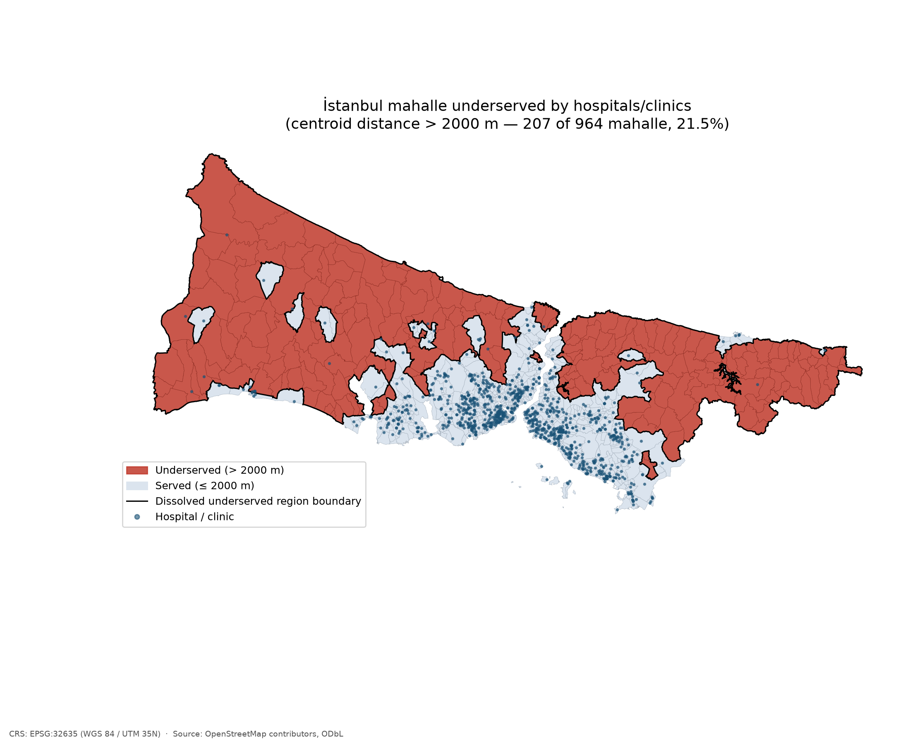
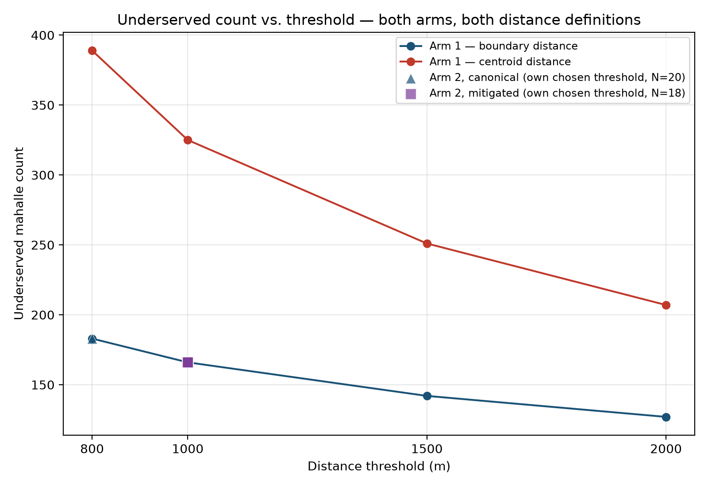
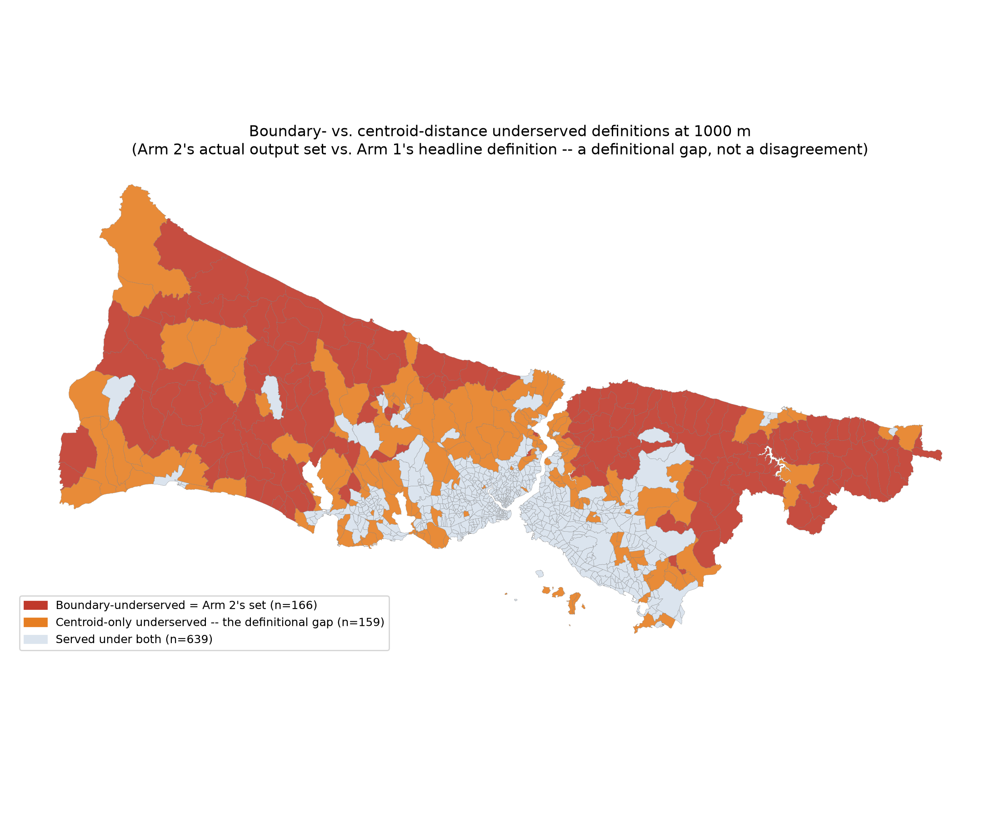

# Which İstanbul mahalle are underserved by hospitals and clinics?

**Status: Phases 0–7 complete.** See `paper/PLAN.md`'s phase table for the
full record of what was done and when. Every number below comes from a
committed result file (`results/rule_based_*`, `results/llm_runs*/`,
`results/metrics.csv`) or from `paper/PLAN.md`'s "Findings" log, and every
figure comes from `notebooks/05_results.ipynb`'s real, tested execution
(`results/figures/`) — per `STUDY_LOG.md`'s rule against invented or
synthetic numbers or illustrative figures in a final result, nothing here
is estimated.

## 1. Introduction

Health-facility accessibility — how far a resident is from the nearest
hospital or clinic — is a standard spatial-equity question, usually
answered by a GIS analyst writing an explicit pipeline: reproject to a
metric CRS, compute nearest-neighbor distance, threshold it, dissolve the
result into a map. Large language models are increasingly used to plan
this kind of spatial analysis from a natural-language question instead of
an explicit operation list. This study asks a concrete version of that
question for İstanbul — **which *mahalle* (neighbourhoods) are
underserved by hospitals and clinics?** — and answers it twice: once with
an explicit, hand-written rule-based pipeline (Arm 1), and once by handing
the same question, in natural language, to an LLM-driven spatial-analysis
planner (`smart_spatial_system`'s `s3geo.query()`, Arm 2) and letting it
choose the operations, parameters, and coordinate reference system (CRS)
itself. The two are then compared directly, feature for feature.

The result, stated plainly up front because it is the paper's central
finding: **at `smart_spatial_system` version 0.5.6, Arm 2, given no
hints beyond the bare question, reproduces Arm 1's answer exactly, every
time it was run.** That result did not hold at any earlier pin tested in
this study (0.3.0 through 0.5.5) — every one of those failed for a
specific, diagnosable reason, most of them upstream framework gaps this
study reported and that were subsequently fixed. Section 5 traces that
progression; Section 4 reports the final numbers.

## 2. Data

Both layers come from OpenStreetMap via the Overpass API, covering
İstanbul Province (`admin_level=4` in OSM) on both the European and Asian
sides of the Bosphorus. The unit of analysis is the *mahalle*
(neighbourhood), OSM `admin_level=8` — confirmed by directly probing the
live Overpass database rather than assumed from the study brief (two
independent third-party OSM-derived Turkish administrative datasets had
already suggested 8 over the brief's originally assumed 10; the probe
settled it against the live data: level 6 returns exactly İstanbul's 39
known districts, level 8 returns 964 neighbourhood-sized relations,
levels 9 and 10 return nothing).

`data/raw/` holds **1,020 hospitals and clinics** (421 `amenity=hospital`,
599 `amenity=clinic`) and **964 mahalle boundaries** (955 `Polygon`, 9
`MultiPolygon`), fetched directly against `overpass-api.de` from a
machine with unrestricted internet access. An earlier fetch from a
network-restricted environment, routed through a shared public Overpass
mirror, returned 972 hospitals/clinics and the same 964 mahalle — the
48-facility difference between the two fetches reflects genuine OpenStreetMap
editing activity between fetch times (OSM is a live database), not a
processing error, and both fetches found the same mahalle count, geometry
breakdown, and zero skipped relations. All downstream results use the
1,020/964 fetch.

Both source layers are `EPSG:4326`; every distance, threshold, and area
computation in Arm 1 uses **EPSG:32635** (WGS 84 / UTM zone 35N), which
covers all of İstanbul Province — including its eastern edge — inside a
single UTM zone, so no zone-boundary correction is needed. Section 4
reports that Arm 2, asked to choose its own CRS, independently converges
on the same EPSG:32635 as of `smart_spatial_system` 0.5.5 onward.

Known data caveats, carried through the pipeline rather than smoothed
over: hospital and clinic *relations* (e.g. a large campus mapped as a
multipolygon) are not fetched, only nodes and ways, so a small number of
large campuses may be under-represented; the `amenity` value is kept as a
feature property throughout so the hospital-only subset can be re-derived
without a new fetch; and 9 of the 964 mahalle have a centroid that falls
outside their own polygon (irregular or island-like shapes), confirmed by
two independent computations agreeing exactly. OpenStreetMap data is ©
OpenStreetMap contributors under the Open Database License (ODbL); every
derived file and figure in this study carries the same attribution
requirement (Section 7).

## 3. Method

### 3.1 Arm 1 — rule-based

An explicit pipeline: reproject both layers to EPSG:32635; for each
mahalle, find the nearest hospital/clinic by **polygon-to-point**
nearest-neighbor distance (`find_nearest_neighbors`) — a mahalle
containing a facility gets distance 0.0, which is correct GIS behaviour
but produces ties among facility-dense neighbourhoods; separately compute
the same distance from each mahalle's **centroid**, since for a
health-access question the centroid figure is arguably the more
representative one for where residents actually live; join each hospital
to its containing mahalle via `spatial_join_features` (1,020/1,020
matched, zero unmatched — no coastline or boundary edge cases lost); flag
"underserved" at three thresholds (1,000 / 1,500 / 2,000 m) rather than
one, so the headline number's sensitivity to the cutoff is visible rather
than hidden; and dissolve the underserved mahalle into contiguous regions
for mapping. The **2,000 m threshold is the headline default**, treated
throughout as a parameter, not a finding.

### 3.2 Arm 2 — LLM-planned

The same two layers, in their original unprojected `EPSG:4326` form, and
one natural-language query — stated once, committed, identical across
every run — handed to `s3geo.query()`:

> "Layers: 'hospitals' is a point layer of hospitals and clinics in
> Istanbul, Turkey, in EPSG:4326. 'mahalle' is a polygon layer of
> Istanbul neighbourhood (mahalle) boundaries, also in EPSG:4326. For
> each mahalle, determine how far it is from the nearest hospital or
> clinic, and identify which mahalle are underserved because their
> nearest facility is too far away."

The query deliberately omits the distance threshold, the target CRS, the
centroid-vs-boundary choice, and the operation sequence — choosing those
is exactly what is being measured. Run N = 20 times at temperature 0.1
(`gpt-4o-mini`, via an OpenAI-compatible endpoint), both values inherited
from a sibling case study (`smart-spatial-vienna-accessibility`) and kept
unless early variance argued otherwise (it did not — see Section 4). Every
run, success or failure, is saved verbatim to `results/llm_runs/`; a
failure is data, not something to retry away. A second, **mitigated**
batch of 20 runs adds a short `system_hints` string naming the region's
correct UTM zone and warning against a self-defeating distance cap — a
documented, named local mitigation for two framework gaps this study
found and reported upstream (Section 5), never a silent workaround, and
never an edit to the pinned package.

### 3.3 Comparison metric

Full specification in `paper/comparison_metric.md`; summarized here.
Three layers, computed over both of Arm 2's batches against Arm 1's
single deterministic reference: **Plan Agreement Rate (PAR)** — do
repeated runs build the same *shape* of plan (operation sequence)?;
**parametric agreement** — among structurally identical plans, how much
do the invented parameters (threshold, CRS) vary?; and **outcome
agreement** — Jaccard overlap of the underserved-mahalle *set* between
runs and against Arm 1 (the primary measure, since the answer a reader
sees is a set, not a ranking), plus Spearman rank correlation of the
continuous per-mahalle distance as a secondary measure. A run is checked
for **degeneracy** (empty set, universal set, or every distance identical)
before any stability metric is computed from it — a batch can look 100%
successful while being entirely meaningless, which is precisely what
motivated checking for it explicitly rather than trusting a raw success
rate.

## 4. Results

### 4.1 Arm 1

At the 2,000 m headline threshold (centroid distance), **207 of 964
mahalle (21.5%) are underserved**; 251 at 1,500 m; 325 at 1,000 m. The
underserved mahalle dissolve into 6 contiguous regions. All 1,020
hospitals/clinics matched to a containing mahalle. **Figure 1** (§4.6)
maps this result directly.

### 4.2 Arm 2, canonical batch (no hints), at `smart_spatial_system` 0.5.6

**20 of 20 runs executed successfully, and all 20 are an exact match — the
identical set of mahalle, not merely a similar count — to Arm 1's own
underserved set at the boundary-distance definition, at whatever threshold
that run chose for itself.** Nineteen of the twenty runs chose exactly
1,000 m; one chose 800 m. All twenty reprojected both layers to
**EPSG:32635** — the same CRS Arm 1 uses, chosen independently by the
framework from the input data's own extent, not supplied by this study.
None of the twenty set a `max_distance` cap on the nearest-neighbor step
(the pattern responsible for every prior batch's failures — see Section
5). Every one of the twenty accepted plans passed on its first attempt;
none needed the repair mechanism `smart_spatial_system` 0.5.6 introduces.
Median latency 14.4 s/call.

### 4.3 Arm 2, mitigated batch (with `system_hints`), at 0.5.6

18 of 20 runs executed; the other 2 failed on a transient HTTP 401
("incorrect API key") from the LLM provider — an infrastructure error
uncorrelated with the plan or the hint text, not a planning failure, and
excluded from the interpretation below on that basis. **All 18 runs that
reached the model are, again, an exact match to Arm 1's boundary-distance
set at 1,000 m**, with zero variance in threshold or CRS across all 18.
This is statistically indistinguishable from the canonical batch: as of
0.5.6, the hand-written `system_hints` mitigation this study introduced
at an earlier pin (Section 5) no longer measurably helps.

### 4.4 A definitional finding, not a discrepancy

Every Arm 2 run in every batch, at every pin tested in this study,
measures distance from the mahalle **polygon boundary** — the
`nearest_neighbor` operation's default behaviour on polygon input — and
never from the centroid. Compared against Arm 1's own boundary-distance
column, the two arms agree exactly (Section 4.2–4.3); compared against
Arm 1's centroid-based *headline* numbers (207/251/325), they do not,
because they are measuring two different things by design, not because
either is wrong. The **166 boundary-distance-underserved mahalle at
1,000 m** that Arm 2 converges on is a real, correct number under its own
definition — it undercounts Arm 1's centroid-based 1,000 m figure (325)
because a polygon's nearest edge is, by construction, never farther from
a facility than that polygon's centroid is. This gap is reported as a
finding, not resolved by picking one definition as correct: which
distance definition is the more honest one for a health-access question
is exactly the kind of methodological choice that should be visible to a
reader, not buried in a operations dictionary. **Figure 3** (§4.6) maps
this gap directly, at Arm 2's own modal threshold (1,000 m): the two
counts nest exactly (166 boundary-underserved + 159 centroid-only = 325),
confirming the gap is definitional, not a size discrepancy.

### 4.5 Comparison metric summary (`results/metrics.csv`)

| Arm | N | PAR | Threshold (mean±sd) | Set Stability (Jaccard) | Jaccard vs. rule-based | \|U\| (mean±sd) | Rank Stability (ρ) | Success | Degenerate | Median latency |
|---|---|---|---|---|---|---|---|---|---|---|
| rule-based (Arm 1) | 1 | 1.0 | 2000 ± 0 (by design) | 1.0 (by construction) | 1.0 | 207 (centroid, 2000 m) | 1.0 (by construction) | 1.00 | 0.00 | n/a |
| LLM, canonical | 20 | 1.0 | 990 ± 44 | 0.9907 ± 0.0279 | 1.0000 | 166.8 ± 3.7 | 1.0000\* | 1.00 | 0.00 | 14.4 s |
| LLM, mitigated | 20 | 0.9 | 1000 ± 0 | 1.0000 ± 0.0000 | 1.0000 | 166.0 ± 0.0 | 1.0000\* | 0.90 | 0.00 | 14.3 s |

\*Rank Stability here is **partial** — computed only over the mahalle each
pair of runs both flagged as underserved, not the full 964. `s3geo.query()`
returns a single final output and does not surface the unfiltered
per-mahalle distance every plan also computes internally; recovering the
full statistic would need a dedicated batch built around that limitation
(see Limitations). The Set Stability figure for the canonical batch
(0.9907, not 1.0) is entirely explained by the one run that chose an 800 m
rather than 1,000 m threshold — a self-consistent, correct choice under a
different (also self-chosen) cutoff, not disagreement about the
underlying computation. **Figure 2** (§4.6) plots this same relationship
directly — every Arm 2 scatter point lands exactly on Arm 1's
boundary-distance curve.

### 4.6 Figures

All three built and tested by `notebooks/05_results.ipynb` against the
committed result files above; none recomputes a distance or calls
`s3geo.query()` again.

**Figure 1 — Arm 1's headline underserved map**
(`results/figures/fig1_underserved_map.png`). Centroid distance, 2,000 m
threshold: 207 of 964 mahalle (21.5%) underserved (red), dissolving into
6 contiguous regions (bold outline); 1,020 hospitals/clinics plotted for
context. This is the study's answer to its research question — not a
comparison figure.

**Figure 2 — threshold sensitivity, both arms, both distance definitions**
(`results/figures/fig2_threshold_sensitivity.png`). Underserved count vs.
threshold (800/1,000/1,500/2,000 m) for Arm 1's boundary distance
(183/166/142/127) and centroid distance (389/325/251/207), with every
successful Arm 2 run (20 canonical, 18 mitigated) overlaid at its own
self-chosen (threshold, output-set-size) pair. Every point lands exactly
on the boundary curve — a direct visual restatement of the §4.2–4.3
exact-match finding, derived independently of `results/metrics.csv`'s own
Jaccard computation.

**Figure 3 — the boundary-vs-centroid definitional gap**
(`results/figures/fig3_arm_disagreement.png`), at Arm 2's modal 1,000 m
threshold. **Not an Arm 1 vs. Arm 2 disagreement map** — every successful
Arm 2 run is an exact match to the red region below (§4.2–4.3). Red
(n=166) is Arm 2's actual output set; orange (n=159) is "centroid-only
underserved" — flagged by Arm 1's headline definition but not by Arm 2's
polygon-boundary one; light blue (n=639) is served under both
definitions. 166 + 159 = 325, Arm 1's own headline count at 1,000 m,
confirming the two sets nest exactly rather than merely overlapping in
size.

## 5. Discussion

**How Arm 2 got here is itself a finding.** The 20/20 exact-match result
in Section 4.2 did not hold at any earlier pin tested in this study.
Tracing the progression (full detail in `paper/PLAN.md`'s "Findings"
log):

- At 0.5.0–0.5.3, the canonical (no-hints) batch's structural success
  rate ranged from 1/20 to 18/20, but **zero** runs across any of those
  batches produced a valid answer: every executing run reprojected to
  `EPSG:31256` ("MGI / Austria GK East") — copied from a Vienna-specific
  worked example in the framework's own prompt template, nothing in the
  prompt telling the model not to reuse it verbatim for a different city.
- At 0.5.4, fixing that literal copy-paste (replacing the worked example
  with a placeholder) surfaced a *new* failure mode: roughly 60% of runs
  crashed on the placeholder token itself, and the rest converged on Web
  Mercator (EPSG:3857) — plausible-looking, geographically unbounded, and
  about 32.5% too long for real distance at İstanbul's latitude. This
  study's own `system_hints` mitigation (stating the correct CRS
  explicitly) was, at this pin, the only way to get a usable Arm 2 result
  at all.
- At 0.5.5, the framework began computing a projected CRS **from the
  input data's own extent** rather than asking the model to recall or
  copy one — a structural fix, not a better prompt. The unmitigated batch
  jumped to 9/20 exact matches; every remaining failure traced to a
  single pattern, a `max_distance` cap on the nearest-neighbor step that
  silently starved a downstream distance filter of the exact candidates
  it needed.
- At 0.5.6, the framework added a validator that rejects that specific
  self-defeating pattern before execution, plus a one-shot automatic
  repair when a generated plan fails validation. The result is Section
  4.2's 20/20.

Three rounds of prompt-level patching (a wrong literal example, then a
placeholder, then this study's own hand-written hint) were each overtaken
by one data- or validation-level fix that removed the model's need to
*guess* the right answer at all. That progression — and the fact that a
raw "did the plan finish executing" success rate would have called 0.5.4
a regression from 0.5.3, when it was actually surfacing failures earlier
and more specifically — is itself a methodological point worth making
about evaluating an LLM-planned pipeline against a moving upstream
target: the *rate* of successful execution is not the same question as
the *validity* of what executed, and the two can move in opposite
directions across a single dependency bump.

**The distance-definition gap (Section 4.4) is a more durable finding
than the CRS/threshold story.** Across every batch at every pin, the LLM
planner never once chose to measure from the mahalle centroid, only ever
from the polygon boundary — the `nearest_neighbor` operation's default,
and arguably the less obviously "correct" choice for a question about
where residents live rather than where a neighbourhood's edge is. Whether
that is a property of the operation's design, the prompt's phrasing, or
something a sufficiently different natural-language query would change is
not resolved by this study and is a natural next question.

Other caveats, named rather than smoothed over: all distances here are
**straight-line (Euclidean)**, not network distance — in a city divided by
the Bosphorus and cut by steep topography, this is a real limitation for
walking/driving access, not a cosmetic one, and upgrading to network
distance is a natural follow-up rather than in scope here. **Population
weighting** is not applied — an underserved mahalle of 200 residents and
one of 40,000 are treated identically in the current pipeline, and TÜİK
publishes mahalle-level population that could close this gap in future
work. Both arms currently report the combined "hospital or clinic"
definition as headline; a hospital-only re-run is possible from the same
data (the `amenity` tag is preserved throughout) but not yet reported
separately.

## 6. Limitations

- **Rank Stability (Section 4.5) is partial, not the full-population
  statistic the comparison metric specifies.** It is computed only over
  the mahalle each pair of runs both happened to flag as underserved, not
  all 964 — a real gap in what `s3geo.query()`'s single-output API
  surfaces, documented in `notebooks/04_comparison_metric.ipynb` rather
  than silently reported as the complete statistic.
- **Straight-line distance, not network distance** — named above, and a
  material limitation given the Bosphorus and İstanbul's topography.
- **No population weighting** — an underserved mahalle's size is not
  reflected in the headline count.
- **A small number of large hospital campuses mapped as OSM relations are
  not fetched** (nodes and ways only); the study has not quantified how
  many such campuses exist in the AOI or how much this affects the count.
- **This study's own findings are entangled with a fast-moving upstream
  dependency.** Every batch reported here is pinned to a specific,
  recorded `smart_spatial_system` release, and several of this study's own
  bug/enhancement reports directly shaped the releases that followed
  (`bugs/001`–`006`, `enhancements/001`–`003`) — a real methodological
  question for anyone trying to reproduce "how well does an LLM plan
  spatial analysis" as a general claim, rather than "how well did this
  specific pinned version do on this specific question," which is the
  narrower and more defensible claim this paper actually makes.
- **N = 20 at temperature 0.1, one model (`gpt-4o-mini`), one query
  phrasing.** Both the sample size and temperature are inherited from a
  sibling study rather than independently justified here; given the
  0.5.6 canonical batch's own variance (Set Stability 0.9907, driven by a
  single run's independent threshold choice) turned out to be very low,
  a smaller N might have been adequate in retrospect, but this was not
  known in advance.

## 7. Data and code availability

Source data: OpenStreetMap, © OpenStreetMap contributors, [Open Database
License (ODbL)](https://www.openstreetmap.org/copyright). Exact Overpass
queries, fetch dates, and caveats: `data/README.md`. Processed data,
per-run LLM outputs (`results/llm_runs/`, `results/llm_runs_mitigated/`),
the rule-based arm's full output (`results/rule_based_*`), the comparison
metric (`results/metrics.csv`), and the three figures in §4.6
(`results/figures/`) are committed alongside this paper. Analysis code:
`notebooks/01`–`05` (numbered, run in order); each is this study's
deliverable for its phase, not a scratch file. The pinned dependency,
`smart_spatial_system`, is never modified in place — see `STUDY_LOG.md` for
the reporting convention used for every upstream bug/enhancement this
study found (`bugs/`, `enhancements/`). Repository code is MIT-licensed;
the data is not.
